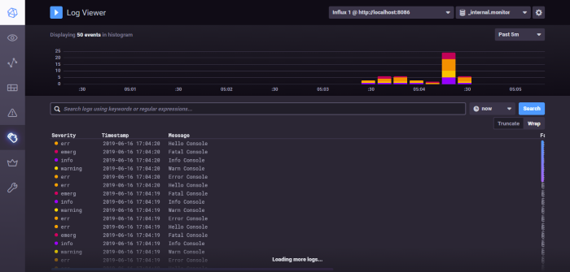

# Log4net.Appender.InfluxDBSyslog
Log4net appender that posts events to InfluxDB in Syslog format

[](https://www.nuget.org/packages/Serilog.Sinks.InfluxDB.Syslog)
[](https://www.nuget.org/packages/Serilog.Sinks.InfluxDB.Syslog/absoluteLatest)
[](https://www.nuget.org/packages/Serilog.Sinks.InfluxDB.Syslog/)
[![License](https://img.shields.io/badge/license-MIT-blue.svg?style=for-the-badge&logo=data%3Aimage%2Fpng%3Bbase64%2CiVBORw0KGgoAAAANSUhEUgAAAEAAAABACAYAAACqaXHeAAAAAXNSR0IArs4c6QAAAARnQU1BAACxjwv8YQUAAAAJcEhZcwAAHYcAAB2HAY%2Fl8WUAAAAZdEVYdFNvZnR3YXJlAHBhaW50Lm5ldCA0LjAuMTCtCgrAAAADB0lEQVR4XtWagXETMRREUwIlUAIlUAodQAl0AJ1AB9BB6AA6gA6MduKbkX%2BevKecNk525jHO3l%2Fp686xlJC70%2Bl0C942vjV%2Bn9FreVQbBc0wWujfRpW8Z78JaIb53hhJ1ygTA80w9PQ36duBMjHQHPCuoQZfutSjeqU1PAJN4E3j2pN7aVKv6pnWcgGawNfGa5N6prVcgGZBn8yvVXZXQbOgPXokXaPMNZwoc41D%2FaHZ8b7hpBrKjnCizIjD%2FaHZ8aPR6%2BeZXqqh7Agnyow43B%2BaZz40qnQ36a6rlsYgnChDLOkPzTN1z%2B9PafU0N3OAcaIMsaQ%2FNBufG1X9JyrtDMr0Y4xwokxlWX%2BPjAYdemhPrWeDvYcPJ8r0LO3v4oszNfivQQuTp2u9qJGKE2V6lvZ38UVj9q3t3oqEE2U2lvfXF4t6qPjTqDUV1fRyhw8nymws768vfOr2NtqOqFY4UUZE%2BusL6VDRX7%2FGzOHDiTIi0t9WMPsUKzNPx4kysf62gmuHir3sPXw4USbWny485ZOc2PsJ7VTro%2F3pwp5DxV7qHq2xa41TrY%2F2J7PfJkaHir3UwwdtU061PtqfTP0CUaYm2v3LxCtoDI2lMWk8p1of7Y8K0jhRJgaaYZwoE0P%2FpFUndZqtP6T4BE2zC5qtP6T4BE2zC5qtPyRN8OvhZUQae3ZBtT7anyb49PA6Ivp5wKnWR%2FvbJkncZXr6wokysf62CXRCWjmJxhqd2JwoE%2BuvTqS37JGJlB39GLzhRJmN5f31gz8XTpSJgWYYJ8rEQDOME2VioBnGiTIx0AzjRJkYaIZxokwMNMM4USYGmmGcKBMDzTBOlImBZhgnysRAM4wTZWKgGcaJMjHQDONEmRhohnGiTAw0wzhRJgaaYZwoEwPNME6UiYFmGCfKxEAzjBNlYqAZxokyMdAMoL%2FO%2BNi4bzjpT1e%2BNFb8V7gFzUXMLHqk%2BM1A8wArFj1S5GagOUly0SMtuxloTnJrUU%2B7QXOSW4t62g2ak9xa1NNu0Jzk1qKednK6%2Bw9roIB8keT%2F3QAAAABJRU5ErkJggg%3D%3D)](LICENSE.md)

| Branch   | Status         |
| -------- | -------------- | 
|Master Branch|[](https://ci.appveyor.com/project/MarkZither/log4net-appender-influxdbsyslog/branch/master)|
|Dev Branch|[](https://ci.appveyor.com/project/MarkZither/log4net-appender-influxdbsyslog/branch/dev)|

[](https://sonarcloud.io/dashboard?id=Log4net.Appender.InfluxDBSyslog)


## How to setup
### NuGet Package
Install from nuget 
```
PM> Install-Package Log4net.Appender.InfluxDBSyslog
```

or
```
dotnet add package Log4net.Appender.InfluxDBSyslog --version 0.3.1
```

### Configure the appender
``` xml
<?xml version="1.0" encoding="utf-8" ?>
<configuration>
  <configSections>
    <section name="log4net" type="log4net.Config.Log4NetConfigurationSectionHandler, log4net" />
  </configSections>
  <log4net>
  <appender name="InfluxAppender" type="Log4net.Appender.InfluxDBSyslog.InfluxAppender, Log4net.Appender.InfluxDBSyslog">
    <Scheme>http</Scheme>
    <Host>localhost</Host>
    <RemotePort>8086</RemotePort>
    <AppName>Console Test</AppName>
    <Facility>Console Test Custom Facility</Facility>
  </appender>
    <root>
      <level value="INFO" />
      <appender-ref ref="InfluxAppender" />
    </root>
  </log4net>
</configuration>
```

### Configure the appender with a layout to support properties 
``` xml
<?xml version="1.0" encoding="utf-8" ?>
<configuration>
  <configSections>
    <section name="log4net" type="log4net.Config.Log4NetConfigurationSectionHandler, log4net" />
  </configSections>
  <log4net>
  <appender name="InfluxAppender" type="Log4net.Appender.InfluxDBSyslog.InfluxAppender, Log4net.Appender.InfluxDBSyslog">
    <Scheme>http</Scheme>
    <Host>localhost</Host>
    <RemotePort>8086</RemotePort>
    <AppName>
        <layout type="log4net.Layout.PatternLayout">
			  <conversionPattern value="%date AppName2 Test" />
		  </layout>
	  </AppName>
    <Facility>Console Test Custom Facility</Facility>
  </appender>
    <root>
      <level value="INFO" />
      <appender-ref ref="InfluxAppender" />
    </root>
  </log4net>
</configuration>
```

### InfluxDB and Chronograf
Download InfluxDB 1.7 from [influxdata.com](https://portal.influxdata.com/downloads/)

Run influxd and chronograf and see your logs flowing in.


### Dependencies

    - log4net
    - InfluxData.net

### Building the project

    dotnet build

## Benchmarks

``` ini

BenchmarkDotNet=v0.12.1, OS=Windows 10.0.19041.450 (2004/?/20H1)
Intel Core i7-2640M CPU 2.80GHz (Sandy Bridge), 1 CPU, 4 logical and 2 physical cores
.NET Core SDK=3.1.400-preview-015203
  [Host]     : .NET Core 2.1.16 (CoreCLR 4.6.28516.03, CoreFX 4.6.28516.10), X64 RyuJIT
  DefaultJob : .NET Core 2.1.16 (CoreCLR 4.6.28516.03, CoreFX 4.6.28516.10), X64 RyuJIT


```
|                                        Method |    N |           Mean |        Error |       StdDev |       Median |
|---------------------------------------------- |----- |---------------:|-------------:|-------------:|-------------:|
|                        LogSomethingNoAppender | 1000 |       681.9 ns |     12.53 ns |     11.72 ns |     678.8 ns |
|                                  LogSomething | 1000 | 1,008,850.6 ns | 25,344.37 ns | 69,805.77 ns | 995,548.6 ns |
|               LogSomethingRollingFileAppender | 1000 |    18,459.7 ns |    354.54 ns |    639.31 ns |  18,304.9 ns |
| LogSomethingRollingFileAppenderNoStringInterp | 1000 |    17,923.6 ns |    350.97 ns |    328.30 ns |  17,751.9 ns |
|                  LogSomethingInfluxWithLayout | 1000 |   444,051.0 ns | 22,226.97 ns | 62,326.82 ns | 415,885.4 ns |
|               LogSomethingWithLayoutNoConsole | 1000 |   522,403.7 ns | 13,862.15 ns | 39,098.45 ns | 526,787.7 ns |
|        LogSomethingBuffering1InfluxWithLayout | 1000 |   819,144.6 ns |  9,321.40 ns |  7,277.53 ns | 819,914.1 ns |
|        LogSomethingBuffering5InfluxWithLayout | 1000 |   156,899.9 ns |  2,402.27 ns |  5,119.43 ns | 155,756.2 ns |
|       LogSomethingBuffering10InfluxWithLayout | 1000 |    95,998.6 ns |  1,342.31 ns |  2,711.54 ns |  95,510.6 ns |

## Contribute

If you have any idea for an improvement or found a bug, do not hesitate to open an issue.

## Thanks

[Get Your Syslog On](https://www.influxdata.com/blog/get-your-syslog-on/)  
[Writing Logs Directly to InfluxDB - DZone](https://dzone.com/articles/writing-logs-directly-to-influxdb)


## License

Log4net.Appender.InfluxDBSyslog is distributed under MIT License.
